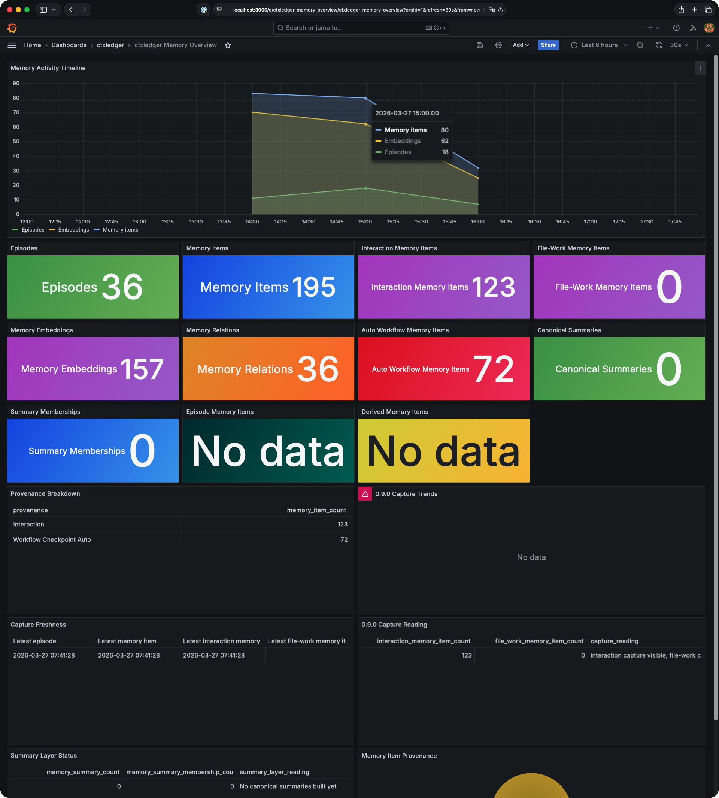

# ctxledger 日本語README



`ctxledger` は、AIエージェント向けの durable workflow runtime / memory system です。

`ctxledger` は、次のような agent work を求めるチーム向けの remote MCP server です。

- セッションをまたいで resume できる
- プロセス再起動後も durable に残る
- PostgreSQL に canonical state として記録される
- 後から検索・確認できる
- CLI と Grafana で観測できる

提供するもの:

- workflow lifecycle control
- 自動 / 明示 memory capture
- bounded historical recall
- file-work metadata capture
- PostgreSQL-backed persistence
- HTTPS 対応のローカル deployment
- operator 向け observability
- 標準ローカル構成での Apache AGE graph support

---

## 利用者向け

### ローカル起動で得られるもの

標準のローカル構成では次を使えます。

- MCP endpoint
  - `https://localhost:8443/mcp`
- Grafana
  - `http://localhost:3000`
- 認証つき HTTPS アクセス
- repository-owned local image path を使う PostgreSQL 17
- Docker Compose による一式起動

### クイックスタート

#### 1. リポジトリを取得して移動する

```/dev/null/sh#L1-2
git clone https://github.com/rioriost/ctxledger.git
cd ctxledger
```

#### 2. TLS 証明書を用意する

`ctxledger` は `localhost` 用のローカル証明書を前提にします。

`mkcert` を使う例:

```/dev/null/sh#L1-3
mkdir -p docker/traefik/certs
mkcert -install
mkcert -cert-file docker/traefik/certs/localhost.crt -key-file docker/traefik/certs/localhost.key localhost 127.0.0.1 ::1
```

#### 3. `.env.example` を `.env` にコピーする

```/dev/null/sh#L1-1
cp .env.example .env
```

#### 4. `.env` の generated-secret placeholder を埋める

最も早く使い始めるには、`.env.example` をコピーしたあと、helper script で次の placeholder をまとめて埋めるのが簡単です。

- `CTXLEDGER_SMALL_AUTH_TOKEN`
- `CTXLEDGER_GRAFANA_ADMIN_PASSWORD`
- `CTXLEDGER_GRAFANA_POSTGRES_PASSWORD`

```/dev/null/sh#L1-1
python scripts/populate_env_placeholders.py .env --mode local
```

生成される `CTXLEDGER_GRAFANA_ADMIN_PASSWORD` は、Grafana の password policy に通りやすいように、英大文字・英小文字・数字・記号を含む形式です。

#### 5. `OPENAI_API_KEY` を `.env` に追加する

デフォルトのローカル構成では embedding が有効なので、`OPENAI_API_KEY` は必須です。

`.env` を開いて、自分の API key を入れてください。

```/dev/null/dotenv#L1-6
OPENAI_API_KEY=replace-with-your-openai-api-key
CTXLEDGER_SMALL_AUTH_TOKEN=generated-value
CTXLEDGER_GRAFANA_ADMIN_USER=admin
CTXLEDGER_GRAFANA_ADMIN_PASSWORD=generated-value
CTXLEDGER_GRAFANA_POSTGRES_USER=ctxledger_grafana
CTXLEDGER_GRAFANA_POSTGRES_PASSWORD=generated-value
```

[`envrcctl`](https://github.com/rioriost/envrcctl) を使うなら、まず shell helper script で local ctxledger 用 secret を登録します。

```/dev/null/sh#L1-1
sh scripts/bootstrap_envrcctl_secrets.sh
```

そのあとで、自分の実際の `OPENAI_API_KEY` も `envrcctl` に登録してください。

```/dev/null/sh#L1-1
envrcctl secret set --account 'ctxledger_openai_api_key' OPENAI_API_KEY
```

#### 6. `.rules` ファイル

`.rules` ファイルは、`ctxledger` を有効に利用するためには必須です。

AIエージェントで開発する対象プロジェクトのディレクトリにコピーして、そのまま使えます。

#### 7. スタックを起動する

通常の起動:

```/dev/null/sh#L1-1
docker compose --env-file .env -f docker/docker-compose.yml -f docker/docker-compose.small-auth.yml up -d --build
```

`envrcctl` を使う場合:

```/dev/null/sh#L1-1
envrcctl exec -- docker compose -f docker/docker-compose.yml -f docker/docker-compose.small-auth.yml up -d --build
```

#### 8. endpoint を確認する

認証なしでは拒否されるはずです。

```/dev/null/sh#L1-1
python scripts/mcp_http_smoke.py --base-url https://localhost:8443 --expect-http-status 401 --expect-auth-failure --insecure
```

認証ありでは workflow シナリオが通るはずです。

```/dev/null/sh#L1-1
python scripts/mcp_http_smoke.py --base-url https://localhost:8443 --bearer-token YOUR_TOKEN_HERE --scenario workflow --workflow-resource-read --insecure
```

`YOUR_TOKEN_HERE` は `CTXLEDGER_SMALL_AUTH_TOKEN` の値に置き換えます。

#### 9. Grafana を開く

Grafana:

```/dev/null/txt#L1-1
http://localhost:3000
```

ログイン情報:

- username
  - `CTXLEDGER_GRAFANA_ADMIN_USER`
- password
  - `CTXLEDGER_GRAFANA_ADMIN_PASSWORD`

#### 10. MCP クライアントを接続する

Zed設定例:

```/dev/null/json#L1-7
{
  "ctxledger": {
    "url": "https://localhost:8443/mcp",
    "headers": {
      "Authorization": "Bearer YOUR_TOKEN_HERE"
    }
  }
}
```

VS Code設定例:

```
"servers": {
		"ctxledger": {
			"url": "https://localhost:8443/mcp",
			"type": "http",
			"headers": {
        "Authorization": "Bearer YOUR_TOKEN_HERE"
      }
		}
	},
```

## SSL/TLS troubleshooting

この troubleshooting は、この README で説明している `localhost:8443` の Traefik/TLS ローカル構成向けです。Azure large deployment path で使う Azure Container Apps endpoint には適用しません。

AI エージェントや他の client が certificate trust error を出す場合、まず Traefik がどの証明書を返しているか確認します。

### 1. 実際に返されている証明書を確認

```text
openssl s_client -connect localhost:8443 -servername localhost < /dev/null 2>/dev/null | openssl x509 -noout -subject -issuer
```

期待される出力:

```text
subject=CN=localhost
issuer=CN=localhost
```

もし `TRAEFIK DEFAULT CERT` が出る場合は、ローカル証明書が正しく選ばれていません。

### 2. macOS でローカル証明書を trust する

生成される証明書ファイルは次です。

```text
docker/traefik/certs/dev.crt
```

macOS では、この証明書を Keychain Access に追加し、trust 設定を変更します。

一般的な流れ:

- `docker/traefik/certs/dev.crt` を開く
- Keychain Access に追加
- 証明書の詳細を開く
- Trust セクションで “Always Trust” を選ぶ

### 3. AI エージェント接続を再試行

その後、次の endpoint へ再接続します。

```text
https://localhost:8443/mcp
```

endpoint 自体には到達しているものの、client の probe method を MCP endpoint が受け付けない場合は、HTTP `405 Method Not Allowed` になることがあります。これは method の違いを示すもので、TLS trust failure そのものではありません。

### できること

`ctxledger` を使うと、MCP クライアントや AIエージェントは次の操作を行えます。

- workspace を登録する
- workflow を開始する
- checkpoint を記録する
- durable state から resume する
- verify status つきで workflow を完了する
- 高シグナルな episode を明示記録する
- bounded canonical retrieval として memory を検索する
- hierarchy-aware client 向けの grouped context を読む
- workflow / memory / failure state を確認する

よく使うコマンド:

- `ctxledger stats`
- `ctxledger workflows`
- `ctxledger memory-stats`
- `ctxledger failures`

---

## オプション

### スタックの状態を確認する

```/dev/null/sh#L1-1
docker compose -f docker/docker-compose.yml -f docker/docker-compose.small-auth.yml ps
```

### Grafana を開く

Grafana:

```/dev/null/txt#L1-1
http://localhost:3000
```

ログイン情報:

- username
  - `CTXLEDGER_GRAFANA_ADMIN_USER`
- password
  - `CTXLEDGER_GRAFANA_ADMIN_PASSWORD`

### episode summary を明示的に build する

```/dev/null/sh#L1-4
python -m ctxledger.__init__ build-episode-summary \
  --episode-id <episode-uuid> \
  --summary-kind episode_summary \
  --format json
```

### derived AGE graph の状態確認 / refresh

readiness:

```/dev/null/sh#L1-1
ctxledger age-graph-readiness
```

derived summary graph を refresh:

```/dev/null/sh#L1-1
ctxledger refresh-age-summary-graph
```

constrained graph を bootstrap:

```/dev/null/sh#L1-1
ctxledger bootstrap-age-graph
```

### 現在のローカル deployment mode を確認する

この repository でサポートするローカル標準 deployment mode は次です。

- `small`
  - HTTPS
  - proxy-layer authentication
  - Grafana 有効
  - Apache AGE 有効
  - repository-owned PostgreSQL image path

---

## 開発者向け

現在の system shape を見るなら、まず次を見てください。

- product overview
  - `docs/project/product/specification.md`
  - `docs/project/product/architecture.md`
  - `docs/project/product/mcp-api.md`
  - `docs/project/product/memory-model.md`
- operations
  - `docs/operations/README.md`
- memory docs
  - `docs/memory/README.md`
- release state
  - `docs/project/releases/CHANGELOG.md`
  - `docs/project/releases/0.9.0_acceptance_review.md`
  - `docs/project/releases/0.9.0_closeout.md`

便利な repository script:

- `scripts/apply_schema.py`
- `scripts/ensure_age_extension.py`
- `scripts/mcp_http_smoke.py`
- `scripts/setup_grafana_observability.py`
- `scripts/populate_env_placeholders.py`
- `scripts/bootstrap_envrcctl_secrets.sh`

ローカル起動の中心ファイル:

- `docker/docker-compose.yml`
- `docker/docker-compose.small-auth.yml`

現在の development posture:

- PostgreSQL state が canonical
- workflow / checkpoint / projection state は canonical-first
- summary / ranking / graph-backed structures は derived support layer
- file-work metadata は広い file-content indexing なしで保持する
- README は意図的に短くしてあり、詳細は上の docs を見る

---

## ライセンス

Apache License, Version 2.0 の下で提供します。  
`LICENSE` を参照してください。
