# ctxledger 技術概要

この文書は、現在のリポジトリ内ドキュメントと一部の実装確認に基づいています。

実装に関わる記述はコードとスキーマに整合していることを前提とし、ドキュメントと実装が不整合な場合は、コードおよび `schemas/postgres.sql` を優先します。

ただし、この概要はすべての runtime、service、transport path を対象にした完全な行単位監査をまだ終えていないため、retrieval や graph 関連の説明の一部は、完全監査済みの断定ではなく、**現在の bounded な実装 posture** として読んでください。

現時点の整合確認では、少なくとも以下は確認済みです。

- 主たる HTTP MCP runtime の形
- 可視の MCP tool surface と workflow resource surface
- HTTP の request / response path における自動 interaction-memory capture posture

関連する repository-wide reference material:

- `docs/project/product/architecture.md`
- `docs/project/product/workflow-model.md`
- `docs/project/product/memory-model.md`
- `docs/project/product/mcp-api.md`
- `docs/project/product/specification.md`

## 1. 目的

`ctxledger` は、AI agent のための durable workflow runtime であり、同時に multi-layer memory system です。

主な目的は次のとおりです。

- セッションやプロセス再起動をまたいで、正確な workflow state を永続化する
- 安全に resumable な operational state を復元する
- 過去作業から reusable memory を蓄積する
- bounded な historical / contextual knowledge を取り出す
- それらを MCP-compatible な HTTP interface で公開する

`ctxledger` は、永続化されたすべての情報を同じ種類の真実として扱いません。

システム内では次を明確に分けています。

- canonical operational truth
- canonical durable memory
- derived retrieval structures
- auxiliary retrieval outputs

この境界を理解することが、schema と runtime behavior の両方を読む上で重要です。

---

## 2. 設計原則

### 2.1 Canonical state は PostgreSQL にある

PostgreSQL は workflow state と durable memory の canonical system of record です。

workflow 側の canonical records の例:

- `workspaces`
- `workflow_instances`
- `workflow_attempts`
- `workflow_checkpoints`
- `verify_reports`

memory 側の canonical entities の例:

- `episodes`
- `memory_items`
- `memory_relations`
- `memory_summaries`
- `memory_summary_memberships`

### 2.2 Repository files は projection にすぎない

repository 側の artifact や local file は source of truth ではありません。

それらは次の用途では有用です。

- projections
- operator 向け補助情報
- local continuation material
- review artifacts

ただし、canonical workflow state や canonical memory state と混同してはいけません。

### 2.3 Workflow control と memory retrieval は分離されている

`ctxledger` は operational workflow control と memory retrieval を意図的に分離しています。

特に:

- `workflow_resume` は canonical operational state を返す
- `memory_get_context` は support context を返す
- `memory_search` は bounded な search-oriented memory retrieval を返す

この分離により、近似的な retrieval behavior が workflow truth を上書きすることを防いでいます。

### 2.4 Convenience より durable execution を優先する

このシステムは次を優先します。

- restart-safe execution
- explicit lifecycle transitions
- persistent checkpoints
- canonical identifiers
- explicit status boundaries

薄い convenience のために durability を犠牲にはしません。

### 2.5 MCP が public interface である

主たる public runtime surface は `/mcp` の MCP-compatible HTTP です。

transport layer 自体を truth source にせず、workflow と memory の capability を公開します。

---

## 3. システム全体像

高レベルには、`ctxledger` は MCP-capable client と PostgreSQL-backed durable state layer の間に位置します。

現在の system context は次を含みます。

- MCP-compatible client / AI agent
- `/mcp` の authenticated HTTP MCP endpoint
- application runtime / service layer
- canonical store としての PostgreSQL
- optional embedding generation providers
- bounded な vector / graph-backed retrieval support
- operator 向け CLI と observability surface

実際の流れはおおむね次の通りです。

- client が HTTP runtime に MCP request を送る
- runtime が application services に委譲する
- service が canonical PostgreSQL state を読み書きする
- memory retrieval では relational lookup、vector similarity、bounded derived graph support を使うことがある
- operator は CLI stats や observability surface を通じて runtime と memory posture を確認する

主たる serving shape は:

- FastAPI application wrapper
- `uvicorn` process
- `/mcp` の authenticated HTTP MCP path

推奨 deployment posture は:

- reverse proxy
- bearer token authentication
- TLS
- `ctxledger` runtime
- PostgreSQL

### 3.1 システム構成図

Mermaid source:
- `docs/project/product/diagrams/technical-overview-system-context.mmd`

---

## 4. 内部のレイヤードアーキテクチャ

内部設計は layered architecture に従っています。

### 4.1 Transport layer

Transport layer の責務:

- HTTP MCP handling
- request parsing
- response serialization
- protocol-visible error normalization
- authentication boundary behavior

この layer は MCP interface を公開しますが、workflow や memory の truth は持ちません。

### 4.2 Application layer

Application layer の責務:

- tool handling
- resource handling
- use case orchestration
- transaction demarcation
- read-model assembly

workflow と memory の operation を調停しますが、storage detail からは一段上にあります。

### 4.3 Domain layer

Domain layer の責務:

- workflow lifecycle rules
- attempt / checkpoint semantics
- resume semantics
- memory contracts
- invariant enforcement

この layer は「何を意味するか」を定義し、「どう保存するか」は定義しません。

### 4.4 Infrastructure layer

Infrastructure layer の責務:

- PostgreSQL repositories
- SQL execution
- pooled connection usage
- 必要に応じた filesystem interaction
- embedding integration points
- bounded graph-support implementation

上位 layer を支える技術的実装を担います。

### 4.5 Cross-cutting concerns

Cross-cutting concerns の例:

- configuration
- logging
- error taxonomy
- runtime readiness
- request correlation
- lifecycle management

### 4.6 Dependency direction

想定する dependency direction は次の通りです。

- Transport → Application → Domain
- Infrastructure は Application / Domain oriented use case を支える
- Cross-cutting concerns は共有されるが、責務境界を溶かさない

---

## 5. Canonical / Derived / Auxiliary の境界

`ctxledger` を理解する上では、system data を 3 種に分けて考えるのが有効です。

この節は特に重要です。多くの implementation detail は、この境界を明示しないと正しく読めません。

## 5.1 Canonical data

Canonical data は authoritative な durable state です。

含まれるもの:

- workflow records
- attempt records
- checkpoints
- verification records
- episodes
- memory items
- memory relations
- summaries
- summary memberships
- structured failure records
- artifact metadata

Canonical data は PostgreSQL に relational に保存されます。

## 5.2 Derived data

Derived data は retrieval、explainability、indexing、projection を支えるために存在します。

含まれるもの:

- repository projections
- ranked retrieval views
- grouped read models
- vector similarity support
- 実装されている範囲での graph-backed auxiliary support
- summary-first retrieval shaping
- compatibility-oriented な flattened response surface

Derived data は operational に重要なこともありますが、canonical truth source ではありません。

## 5.3 Auxiliary outputs

Auxiliary outputs は reasoning や recall を助けるための出力であり、workflow truth ではありません。

代表例は `memory_get_context` です。これは canonical と derived の両方を使って support context を組み立てて返します。

Auxiliary context はたとえば:

- grouped
- filtered
- route-aware
- summary-first
- relation-assisted
- `primary_only` のような flag により bounded

であり得ますが、正確な workflow resume と同一視してはいけません。

## 5.4 Resume は recall ではない

この違いは非常に重要です。

### `workflow_resume`
呼び出し側が正確な current operational state を必要とする時に使います。

典型的な関心事:

- current workflow identity
- current attempt
- latest checkpoint
- latest verify state
- resumability status
- safe continuation のための next hint

### `memory_get_context`
呼び出し側が support context を必要とする時に使います。

典型的な関心事:

- 以前に何が起きたか
- 何が学ばれたか
- どんな related memory が役に立つか
- どの summary や memory group を先に見せるべきか

### `memory_search`
persisted memory に対して bounded な lexical / semantic retrieval が必要な時に使います。

典型的な関心事:

- similar prior work
- failure reuse
- interaction memory
- file-work signals
- reusable patterns

---

## 6. Workflow Architecture

workflow subsystem は `ctxledger` の operational core です。

## 6.1 Identity layers

workflow model は複数の identity layer を区別します。

### Plan-layer identity
ユーザー向け、または外部の planning identity。

例:

- `ticket_id`

### Execution-layer identity
durable な workflow execution identity。

- `workflow_instance_id`

### Operational identity
具体的な execution / resumability identity。

- `attempt_id`
- `checkpoint_id`

この分離により、ユーザーが認識する task reference と、durable runtime record、およびその内部の concrete progress snapshot を区別できます。

## 6.2 Core workflow entities

### `workspaces`
workflow が動く repository scope を表します。

主要 field:

- `workspace_id`
- `repo_url`
- `canonical_path`
- `default_branch`
- `metadata_json`

### `workflow_instances`
workspace 上の task に対する top-level durable execution record です。

主要 field:

- `workflow_instance_id`
- `workspace_id`
- `ticket_id`
- `status`
- `metadata_json`

schema は partial unique index により、workspace ごとに同時に 1 つの running workflow しか持てないようにします。

### `workflow_attempts`
1 つの workflow は複数の concrete attempt を持てます。

主要 field:

- `attempt_id`
- `workflow_instance_id`
- `attempt_number`
- `status`
- `failure_reason`
- `verify_status`

schema は workflow instance ごとに同時に 1 つの running attempt しか持てないようにもしています。

### `workflow_checkpoints`
checkpoint は resumable な execution snapshot です。

主要 field:

- `checkpoint_id`
- `workflow_instance_id`
- `attempt_id`
- `step_name`
- `summary`
- `checkpoint_json`

`checkpoint_json` は current objective や next intended action のような structured state を持つため重要です。

### `verify_reports`
verify report は canonical verification evidence です。

主要 field:

- `verify_id`
- `attempt_id`
- `status`
- `report_json`

## 6.3 Workflow lifecycle

通常の lifecycle は次の通りです。

1. workspace registration
2. workflow start
3. attempt creation
4. execution
5. checkpoint creation
6. optional verification
7. further execution
8. terminal completion / failure / cancellation
9. optional memory formation

`workflow_complete` は terminal transition です。  
generic な save-progress operation ではありません。

## 6.4 Resume behavior

`WorkflowService.resume_workflow(...)` は canonical record から operational resume state を再構築します。

現在の実装形では、少なくとも次を lookup / assembly します。

- workflow instance
- workspace
- running または latest attempt
- latest checkpoint
- latest verify report
- resumability classification
- next-hint derivation

resume path には stage-by-stage diagnosis のための timing-aware instrumentation も入っています。

これは implementation detail ですが、resume が単なる convenience lookup ではなく、実運用される operational path であることを示しています。

workflow semantics や identity model 全体は `docs/project/product/workflow-model.md` を参照してください。

---

## 7. Multi-Layer Memory Architecture

`ctxledger` は、durable workflow history と reusable knowledge を結びつけつつ、同一視しないために layered memory model を採用しています。

現在のモデルは 4 つの conceptual layer で理解するのが最もわかりやすいです。

## 7.1 Layer 1 — Workflow state

正確な operational truth layer です。

答える問いの例:

- どの workflow が active か
- latest checkpoint は何か
- verify state は何か
- 安全に resume できるか

代表 record:

- `workspaces`
- `workflow_instances`
- `workflow_attempts`
- `workflow_checkpoints`
- `verify_reports`

これは単なる「work に関する metadata」ではなく、durable control state そのものです。

## 7.2 Layer 2 — Episodic memory

work と結びついた memorable な経験単位を保持する layer です。

episode は単なる raw event ではなく、durable かつ reusable な memory unit です。

代表 record:

- `episodes`
- `episode_events`
- `episode_summaries`
- `episode_failures`
- `episode_artifacts`

重要な schema fact:

- episode は `workflow_instances` に紐づく
- `attempt_id` にも紐づき得る
- service level では append-only recording semantics を持つ
- 1 workflow に複数 episode を持てる

この layer が扱うものの例:

- 意味のある debugging lesson
- 非自明な root cause
- 設計判断
- failure からの recovery

## 7.3 Layer 3 — Semantic / procedural memory

より retrieval-oriented な形で reusable knowledge を保持する layer です。

代表 record:

- `memory_items`
- `memory_embeddings`
- `memory_relations`

### `memory_items`
workspace に紐づき、必要に応じて episode にも紐づく durable reusable record です。

主要 field:

- `memory_id`
- `workspace_id`
- `episode_id`
- `type`
- `provenance`
- `content`
- `metadata_json`

現在の provenance model に含まれるもの:

- `episode`
- `explicit`
- `derived`
- `imported`
- `workflow_checkpoint_auto`
- `workflow_complete_auto`
- `interaction`

これにより memory layer は次を含められます。

- episode-derived memory
- auto-promoted workflow memory
- interaction memory

### `memory_embeddings`
memory item に対する vector-based retrieval を支えます。

主要 field:

- `memory_embedding_id`
- `memory_id`
- `embedding_model`
- `embedding`
- `content_hash`

embedding は PostgreSQL 上で `VECTOR(1536)` として保存されます。

### `memory_relations`
memory item 間の directional semantic link を表します。

主要 field:

- `memory_relation_id`
- `source_memory_id`
- `target_memory_id`
- `relation_type`
- `metadata_json`

この relation は summary membership とは別概念です。  
この分離は重要です。

## 7.4 Layer 4 — Hierarchical memory

compressed で hierarchy-aware な memory structure を提供する layer です。

代表 record:

- `memory_summaries`
- `memory_summary_memberships`

### `memory_summaries`
memory item より上位にある canonical summary record です。

主要 field:

- `memory_summary_id`
- `workspace_id`
- `episode_id`
- `summary_text`
- `summary_kind`
- `metadata_json`

現在の実装には `build_episode_summary(...)` による explicit な episode-summary build path もあります。これは:

- episode とその memory items を読み込む
- episode memory item が存在しなければ clean に skip する
- 同じ `summary_kind` の既存 summary を置き換えられる
- builder、build scope、build version、remember-path provenance detail を summary metadata に書き込む

### `memory_summary_memberships`
summary から member memory item への canonical parent-child membership edge です。

主要 field:

- `memory_summary_membership_id`
- `memory_summary_id`
- `memory_id`
- `membership_order`
- `metadata_json`

現在の builder は、選ばれた member memory item ごとに canonical membership row を 1 つずつ作り、`membership_order` により deterministic ordering を保ちます。

最小の実装済み hierarchy は次のように理解できます。

- `summary -> memory_item`

これは canonical relational hierarchy であり、graph-native truth model ではありません。

## 7.5 Layer flow

現在のシステムは layer 間を次のように流れます。

- workflow / checkpoint activity が canonical に記録される
- 意味のある work から episode が作られる
- episode や workflow automation から memory item が作られる
- memory item に embedding が付与されることがある
- memory item 同士が relation で結ばれることがある
- memory item が summary の下に束ねられる
- retrieval は summary-first または episode-oriented assembly として grouped context を返す

この flow は、すべての runtime や deployment で常に一様に exercise される保証ではなく、**現在の architectural posture** として読むべきです。

それでも、この layered model は `ctxledger` の最も重要な技術的特徴の 1 つです。

memory の概念モデルは `docs/project/product/memory-model.md` を参照してください。  
grouped retrieval や summary-aware service contract の現在の読みは `docs/memory/design/memory_get_context_service_contract.md` を参照してください。

### 7.6 Multi-layer memory 図

Mermaid source:
- `docs/project/product/diagrams/technical-overview-memory-layers.mmd`

---

## 8. Retrieval Architecture

retrieval model は、operational entry point と memory-oriented entry point に意図的に分離されています。

これは naming の違いではなく、設計の中核です。

## 8.1 `workflow_resume`

`workflow_resume` は operational resume path です。

使うべき場面:

- 正確な continuation
- current workflow status
- current attempt status
- latest checkpoint
- latest verify status

返すのは canonical workflow truth であり、ranked support context ではありません。

## 8.2 `memory_get_context`

`memory_get_context` は support-context retrieval surface です。

現在の性質:

- workflow-linked
- hierarchy-aware
- bounded な relation-aware
- primary と auxiliary の区別を明示
- additive `details` による explainability を持つ

request が受け付ける主な lookup input:

- `query`
- `workspace_id`
- `workflow_instance_id`
- `ticket_id`

主な shaping flag:

- `limit`
- `include_episodes`
- `include_memory_items`
- `include_summaries`
- `primary_only`

### `primary_only`
`primary_only = true` は response-shaping preference です。

意味するもの:

- grouped な primary surface を保つ
- その解釈に必要な route / selection metadata を保つ
- flatter な compatibility-oriented field は必要に応じて落とす

別の retrieval algorithm ではありません。

## 8.3 Current grouped scopes

現在の grouped output model は次の scope を区別します。

- `summary`
- `episode`
- `workspace`
- `relation`

これらの scope により、surfaced context がどこから来たかを説明できます。

## 8.4 Current retrieval routes

現在の retrieval model は次の route を区別します。

- `summary_first`
- `episode_direct`
- `workspace_inherited_auxiliary`
- `relation_supports_auxiliary`
- `graph_summary_auxiliary`

これらの route 名が重要なのは、`ctxledger` が返した context をすべて同格とは扱っていないためです。

これらは、同じ成熟度・runtime coverage・deployment posture を持つと主張するものではなく、**current bounded response-shaping / explainability route** として読むべきです。

現在の実装では、`get_context(...)` の中で少なくとも次の detail を明示的に組み立てています。

- route presence
- route counts
- grouped scopes
- summary-first indicators
- auxiliary-only indicators
- `primary_only` shaping

つまり、route-aware かつ grouped な response posture 自体は implementation-backed です。  
ただし graph 関連や deployment-specific path の一部は、まだここで完全には監査していません。

grouped output は、少なくとも次を読み取るためにあります。

- 何が返されたか
- なぜ返されたか
- どれが primary か
- どれが auxiliary か

## 8.5 Summary-first retrieval

現在の hierarchy-aware retrieval posture は、summary があり、かつ enabled のとき summary-first です。

高レベルには次の bounded path です。

1. candidate workflow を解決する
2. workflow-linked episode を集める
3. 必要なら lightweight query filtering をかける
4. primary visible path を構築する
5. 要求され、かつ利用可能なら direct episode memory を含める
6. 必要に応じて inherited workspace memory を追加する
7. 必要に応じて bounded な relation-supported memory を追加する
8. grouped / route-aware details を返す

これにより、`ctxledger` は単なる flat episode listing より構造化された retrieval model を持ちながら、boundedness と explainability を保っています。

## 8.6 `memory_search`

`memory_search` は memory item に対する bounded な lexical + embedding-backed retrieval を提供します。

現在の実装に含まれるもの:

- content に対する lexical scoring
- metadata key / value に対する lexical scoring
- 設定されている場合の optional embedding-based scoring
- persisted memory item に対する hybrid ranking
- workspace-scoped retrieval
- bounded task-recall integration
- interaction-aware / file-work-aware filtering behavior
- lexical / semantic / hybrid の result composition を区別する ranking detail

つまり `memory_search` は単なる vector-search wrapper ではありません。  
canonical memory に対する bounded retrieval service であり、explicit な explanation surface と implementation-backed な ranking detail を持ちます。

MCP-facing tool / resource behavior は `docs/project/product/mcp-api.md` を参照してください。  
grouped context retrieval の service-contract 読みは `docs/memory/design/memory_get_context_service_contract.md` を参照してください。

### 8.7 Retrieval architecture 図

Mermaid source:
- `docs/project/product/diagrams/technical-overview-retrieval-flow.mmd`

---

## 9. PostgreSQL Technology Map

`ctxledger` の重要な特徴の 1 つは、PostgreSQL を layer ごとにどう使い分けているかにあります。

このシステムは単に「PostgreSQL-backed」なだけではありません。  
relational constraints、`JSONB`、vector support、pooled runtime access が、いずれも architecture を実際に形作っています。

## 9.1 Relational tables と foreign keys

canonical workflow と memory ownership は relational です。

schema は次を土台にしています。

- primary keys
- foreign keys
- unique constraints
- ordinary indexes
- partial indexes
- timestamps と update triggers

これが backbone です。

## 9.2 `JSONB`

`JSONB` は structured metadata と evolving payload のために広く使われています。

代表例:

- `workspaces.metadata_json`
- `workflow_instances.metadata_json`
- `workflow_checkpoints.checkpoint_json`
- `verify_reports.report_json`
- `artifacts.metadata_json`
- `failures.details_json`
- `episodes.metadata_json`
- `memory_items.metadata_json`
- `memory_relations.metadata_json`
- `memory_summaries.metadata_json`
- `memory_summary_memberships.metadata_json`

`JSONB` は、概念を最初からすべて column に落とし切らずに extensibility を保つための重要な要素です。

## 9.3 Unique / partial indexes

この schema は index を performance のためだけでなく business rule のためにも使います。

例:

- workspace ごとに 1 つだけ running workflow
- workflow ごとに 1 つだけ running attempt
- memory item + model ごとに 1 つの embedding
- summary + memory item ごとに 1 つの membership
- source + target + type ごとに 1 つの relation

つまり PostgreSQL は単なる passive store ではなく、invariant enforcement の一部でもあります。

## 9.4 `pgvector`

schema は `vector` extension を有効にし、embedding を次に保存します。

- `memory_embeddings.embedding VECTOR(1536)`

さらに HNSW index も定義しています。

- `idx_memory_embeddings_embedding_hnsw`

これにより `pgvector` は bounded semantic retrieval の vector-similarity support layer になります。

## 9.5 Apache AGE posture

repository design docs では Apache AGE を次のように扱います。

- optional
- derived
- rebuildable
- non-canonical

この posture は現在の architecture direction と一致しています。

この overview では、AGE-backed support は、特に summary や memory relation を中心とした canonical relational record の上に載る graph-oriented retrieval assistance として理解してください。

現在の実装には、graph-readiness explainability metadata も含まれます。例:

- `readiness_state`
- `graph_status`
- `ready`
- `stale`
- `degraded`
- `operator_action`
- `refresh_command`

この explainability path は、AGE を bounded auxiliary summary-member traversal layer として説明し、その canonical source table を次のように示します。

- `memory_summaries`
- `memory_summary_memberships`

AGE を canonical owner of hierarchy として説明してはいけません。また、これは fully audited な end-to-end implementation claim ではなく、**bounded current posture** として読むべきです。

## 9.6 Shared pool と unit-of-work posture

runtime は shared pooled PostgreSQL posture を取ります。

現在の実装方向には次が含まれます。

- process-scoped shared pool ownership
- transaction-scoped unit-of-work usage
- explicit pooled connection borrowing
- explicit pool ownership に合わせた bootstrap path

これは `ctxledger` が stateless facade ではなく、本当に durable runtime として設計されていることを示す重要な技術的特徴です。

canonical summary と hierarchy schema posture は `docs/memory/design/minimal_hierarchy_schema_repository_design.md` を参照してください。  
bounded derived graph-support posture は `docs/memory/design/optional_age_summary_mirroring_design.md` を参照してください。

---

## 10. Relational Data Model Summary

現在の relational model は、いくつかの cluster に分けて読むと理解しやすくなります。

この grouping は architecture を読みやすくするための整理であり、exact な column / constraint / index は schema が source of truth です。

## 10.1 Workflow cluster

core entity:

- `workspaces`
- `workflow_instances`
- `workflow_attempts`
- `workflow_checkpoints`
- `verify_reports`

relationship shape:

- workspace が workflow を持つ
- workflow が attempt を持つ
- workflow と attempt が checkpoint を持つ
- attempt が verify report を持つ

## 10.2 Support / operational metadata cluster

support entity:

- `artifacts`
- `failures`

これらは次に関する durable metadata を保持します。

- external artifacts
- structured failures
- workflow / attempt / checkpoint / episode / memory に紐づく failure state

workflow progression や semantic memory そのものではありませんが、durable technical model の重要な一部です。

## 10.3 Episodic memory cluster

core entity:

- `episodes`
- `episode_events`
- `episode_summaries`
- `episode_failures`
- `episode_artifacts`

relationship shape:

- workflow が episode を持つ
- episode は attempt に紐づくことがある
- episode は events、summaries、failures、artifact link を持つ

## 10.4 Semantic memory cluster

core entity:

- `memory_items`
- `memory_embeddings`
- `memory_relations`

relationship shape:

- workspace が memory item を直接持つことがある
- episode が memory item を持つことがある
- memory item は embedding を持つことがある
- memory item 同士が typed relation で結ばれる

## 10.5 Hierarchical memory cluster

core entity:

- `memory_summaries`
- `memory_summary_memberships`

relationship shape:

- workspace が summary を持つ
- summary は episode に紐づくことがある
- summary が membership を持つ
- membership が `memory_item` を指す

この設計では、意図的に次を分離しています。

- summary membership
- semantic memory relations

この分離は、memory model の中でも特にきれいな architectural choice の 1 つです。

### 10.6 Relational structure 図

#### Workflow ER view

Mermaid source:
- `docs/project/product/diagrams/technical-overview-workflow-er.mmd`

#### Memory ER view

Mermaid source:
- `docs/project/product/diagrams/technical-overview-memory-er.mmd`

---

## 11. Graph Posture と AGE-Backed Support

`ctxledger` における graph support は慎重に読む必要があります。

## 11.1 Graph support は何のためにあるか

graph-backed support は、relational lookup だけでは扱いづらい bounded traversal や retrieval assistance を支えるためにあります。

特に関係するのは:

- summary mirroring
- bounded hierarchy traversal
- auxiliary graph-backed retrieval signals

この節は、repository の current graph-support posture と terminology を説明するものであり、すべての graph-related path を同じ深さで監査済みだと示すものではありません。

## 11.2 Graph support ではないもの

graph support は次ではありません。

- canonical hierarchy ownership
- primary truth source
- ordinary relational retrieval correctness に必須なもの

graph state が missing、stale、degraded でも、canonical relational state が authoritative です。

## 11.3 Minimal graph shape

説明すべき最小の bounded graph shape は次です。

- summary node
- memory item node
- summary から memory item への membership edge
- 実装上意味のある semantic relation edge

概念的には:

- `memory_summary` node
- `memory_item` node
- `summarizes` 的な membership edge
- surfaced される範囲での `supports` 系 relation edge

現在の graph-readiness explainability path は、意図された derived graph label も明示します。

- `memory_summary`
- `memory_item`
- `summarizes`

そしてこれらを `graph_summary_auxiliary` selection route に結びつけ、canonical hierarchy owner とは扱いません。

## 11.4 この posture が重要な理由

この posture によって `ctxledger` は PostgreSQL-first のままでいられます。

graph capability を graph-owned truth と取り違える典型的な誤読を防げます。

設計方向の文書としては `docs/memory/design/optional_age_summary_mirroring_design.md` を参照してください。

### 11.5 Graph posture 図

Mermaid source:
- `docs/project/product/diagrams/technical-overview-graph-posture.mmd`

---

## 12. Interaction / File-Work / Failure-Reuse Memory

`0.9.0` の strengthening work は、単に memory 量を増やすだけではありません。  
何を retrieval-ready memory とみなすかを広げています。

## 12.1 Interaction memory

memory layer は、interaction-oriented metadata を持つ `memory_items` によって interaction memory を支えます。

現在の service 実装には `persist_interaction_memory(...)` があり、次を持つ `memory_items` を作ります。

- `provenance = "interaction"`
- interaction-role metadata
- interaction-kind metadata
- optional な workspace / workflow linkage
- 必要に応じて normalized file-work metadata

主たる HTTP runtime path では、tool call と resource read の両方で、workflow-backed memory service が利用可能な場合、inbound な user-side interaction event と outbound な agent-side interaction event がペアで保存されます。

これにより、user request と agent response を workflow truth と競合しない retrieval-ready memory として扱えます。

## 12.2 File-work metadata

service layer は次の metadata を normalize / filter します。

- `file_name`
- `file_path`
- `file_operation`
- `purpose`

現在の実装では、これらの field は interaction-memory normalization にも、bounded search の filtering / ranking にも関与します。  
そのため、Git-managed file-content indexing を canonical model に持ち込まなくても、file-work signal が bounded failure-reuse や repeated-work recall に効くようになっています。

これは `ctxledger` が抽象的 lesson だけでなく、bounded な file-work context も保持していることを意味します。

## 12.3 Failure reuse

failure と recovery の情報は複数箇所に現れます。

- `failures`
- episode-linked failure records
- memory items
- memory relations
- retrieval-oriented support context

これにより、bounded failure-pattern reuse と recovery recall を支えます。

## 12.4 これらが重要な理由

これらの追加により memory model は次に対してより有用になります。

- resumability
- bounded historical lookup
- failure avoidance
- repeated-work reduction

しかも memory を competing workflow-truth system にしません。

関連する bounded contract:

- `docs/memory/design/minimal_prompt_resume_contract.md`
- `docs/memory/design/interaction_memory_contract.md`
- `docs/memory/design/file_work_metadata_contract.md`
- `docs/memory/design/failure_reuse_contract.md`

---

## 13. Operational Characteristics と Observability

operator や contributor にとって重要な技術的性質がいくつかあります。

## 13.1 Shared connection-pool ownership

現在の runtime posture は次を使います。

- explicit shared PostgreSQL pool ownership
- transaction-scoped unit-of-work execution
- explicit bootstrap / shutdown handling

これは durability、throughput、resume-path stability に効きます。

## 13.2 HTTP MCP runtime posture

現在確認されている主たる serving path は `/mcp` の authenticated HTTP MCP runtime です。

repository 上で bounded に確認できる operation:

- `initialize`
- `tools/list`
- `tools/call`
- `resources/list`
- `resources/read`

これは current overview における主たる confirmed serving posture を示すものであり、あらゆる adapter や transport variation を exhaust した主張ではありません。

現在の HTTP runtime adapter は、少なくとも次の visible MCP tools を登録しています。

- `memory_get_context`
- `memory_remember_episode`
- `memory_search`
- `workflow_checkpoint`
- `workflow_complete`
- `workflow_resume`
- `workflow_start`
- `workspace_register`

また、次の workflow resource も登録しています。

- `workspace://{workspace_id}/resume`
- `workspace://{workspace_id}/workflow/{workflow_instance_id}`

## 13.3 Tool / resource posture

現在見えている MCP tool surface:

- `workspace_register`
- `workflow_start`
- `workflow_checkpoint`
- `workflow_resume`
- `workflow_complete`
- `memory_remember_episode`
- `memory_get_context`
- `memory_search`

現在見えている workflow-resource surface:

- `workspace://{workspace_id}/resume`
- `workspace://{workspace_id}/workflow/{workflow_instance_id}`

現在の HTTP runtime adapter は、tool dispatch と resource dispatch の両方で interaction capture も行っており、これは `0.9.0` の interaction-memory posture にとって重要です。

## 13.4 Observability posture

operator-facing observability には CLI surface と supported metrics が含まれます。

特に memory / hierarchy 関連で重要な metric:

- `memory_summary_count`
- `memory_summary_membership_count`
- `age_summary_graph_ready_count`
- `age_summary_graph_stale_count`
- `age_summary_graph_degraded_count`
- `age_summary_graph_unknown_count`

読む順番は次の通りです。

- canonical summary volume を先に見る
- derived graph posture を後で見る

graph posture が degraded でも、relational summary metric が健全なら canonical summary loss と読んではいけません。

---

## 14. Boundaries と Non-Goals

このシステムを読むとき・拡張するときに守るべき制約があります。

### 14.1 Graph は canonical truth ではない

graph-backed support は retrieval を助けても、canonical ownership は relational にあります。

### 14.2 Memory retrieval は workflow execution ではない

強い memory result が返っても、それは exact resumable workflow state と同じではありません。

### 14.3 Repository file は source of truth ではない

repository 内の file は projection や review artifact としては有用ですが、canonical state ではありません。

### 14.4 `primary_only` は別の retrieval algorithm ではない

同じ retrieval behavior に対する response-shaping mode です。

### 14.5 Bounded historical recall は unconstrained QA ではない

memory subsystem は durable workflow / memory record に対する bounded retrieval のためのものであり、任意の universal QA のためのものではありません。

### 14.6 Hierarchy は generic relation graph ではない

summary membership と semantic memory relation は意図的に別物として扱われます。

---

## 15. まとめ

`ctxledger` の最も重要な技術的特徴は次です。

- PostgreSQL-first な canonical workflow / memory ownership
- workflow control と memory retrieval の明確な分離
- workflow、episodic、semantic、hierarchical にまたがる multi-layer memory model
- `pgvector` による bounded vector-backed retrieval
- AGE による bounded かつ derived / non-canonical な graph-backed support
- flat retrieval だけでなく route-aware / grouped retrieval を持つこと
- resumability と operational continuity を重視した durable MCP-facing runtime

これらを合わせると、`ctxledger` は単なる workflow tracker でも、単なる memory index でもありません。

canonical relational truth に anchored され、layered / bounded / explainable な memory system を備えた durable operational runtime です。